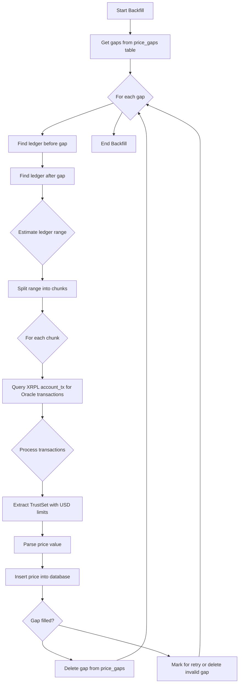

# XRP Price Data Documentation

## Oracle Account

The XRP/USD price data is sourced from the XRPL Oracle account: `rXUMMaPpZqPutoRszR29jtC8amWq3APkx`.

## Price Extraction Method

Prices are extracted from TrustSet transactions posted by the Oracle account. The system monitors these transactions and extracts the USD limit value as the XRP price.

### Key Fields Referenced

- `TransactionType`: Must be "TrustSet"
- `Account`: Oracle address `rXUMMaPpZqPutoRszR29jtC8amWq3APkx`
- `LimitAmount.currency`: Must be "USD"
- `LimitAmount.issuer`: USD issuer `r9PfV3sQpKLWxccdg3HL2FXKxGW2orAcLE`
- `LimitAmount.value`: The XRP/USD price as a string (e.g., "1.90806")
- `ledger_index`: XRPL ledger sequence number
- `date`: Ripple timestamp (seconds since 2000-01-01)
- `Sequence`: Transaction sequence number

### Example Transaction

```json
{
  "tx_json": {
    "TransactionType": "TrustSet",
    "Account": "rXUMMaPpZqPutoRszR29jtC8amWq3APkx",
    "LimitAmount": {
      "currency": "USD",
      "issuer": "r9PfV3sQpKLWxccdg3HL2FXKxGW2orAcLE",
      "value": "1.90806"
    },
    "ledger_index": 100988034,
    "date": 819490160,
    "Sequence": 63671810
  },
  "validated": true
}
```

## Backfilling Logic

The backfilling process fills gaps in historical price data by querying the XRPL ledger for missing Oracle transactions.

### Workflow Diagram



### Detailed Logic

1. **Gap Identification**: The system maintains a `price_gaps` table that tracks time periods where price data is missing.

2. **Ledger Range Calculation**: For each gap, find the ledger index before and after the gap to determine the query range.

3. **Chunk Processing**: Large ledger ranges are split into smaller chunks (max 17 ledgers) to avoid overwhelming the XRPL API.

4. **Transaction Query**: Use the `account_tx` XRPL API command to fetch transactions for the Oracle account within each ledger range.

5. **Price Extraction**: Parse each TrustSet transaction, validate it's from the Oracle with USD currency, and extract the price value.

6. **Database Insertion**: Store the extracted price, timestamp, ledger index, and sequence number in the `xrp_price` table.

7. **Gap Resolution**: If prices are successfully inserted filling the gap, remove the gap record. Otherwise, mark for retry or delete if invalid/out of range.

### Rate Limiting and Error Handling

- Queries are rate-limited with 100ms delays between chunks
- Handles "out of range" errors for very old ledgers
- Skips gaps requiring ledgers before ~2024 (ledger ~95M)
- Validates price values and transaction structure

### Data Integrity

- Only inserts valid, positive price values
- Prevents duplicate entries via database constraints
- Maintains chronological order of price updates
